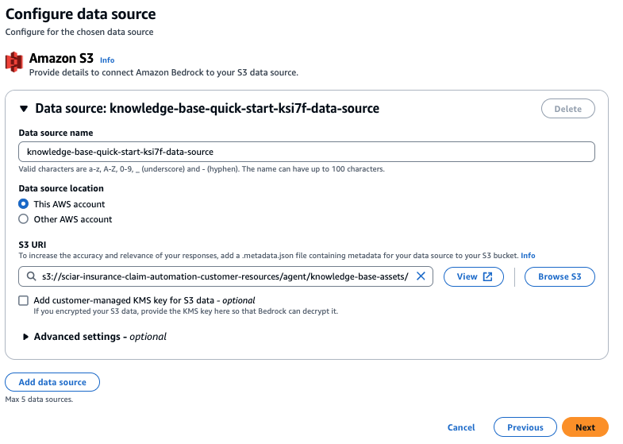
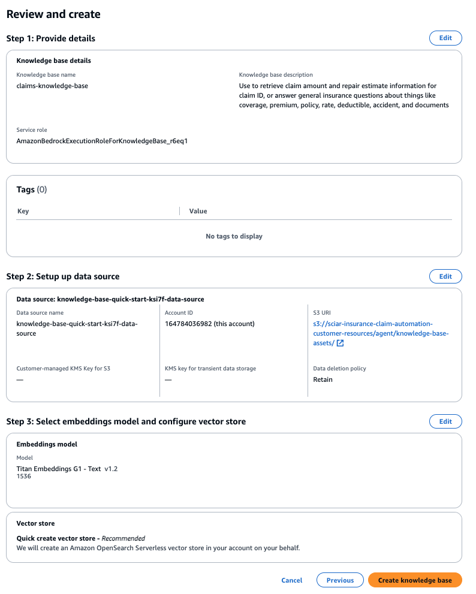
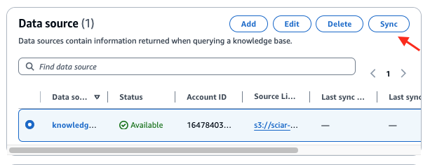
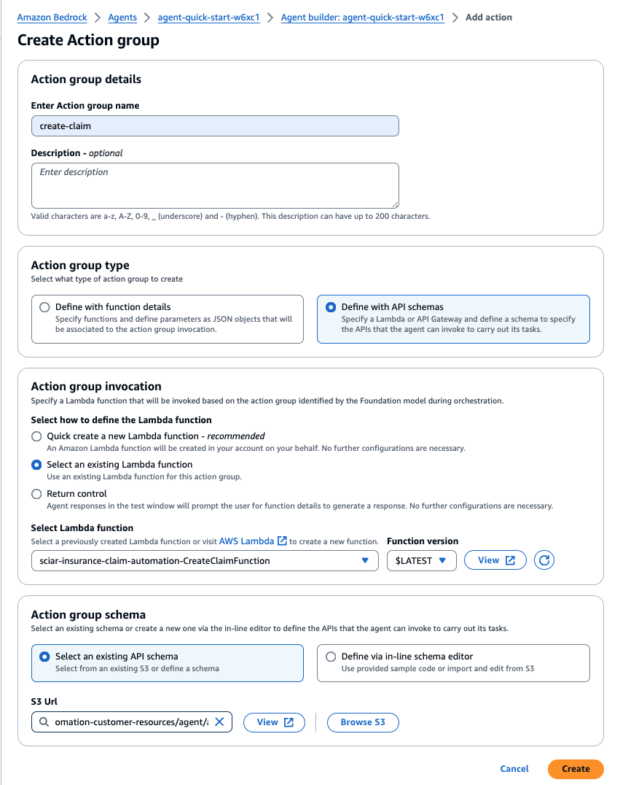
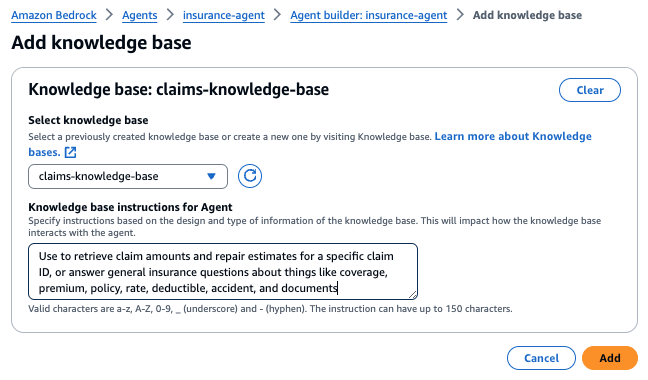
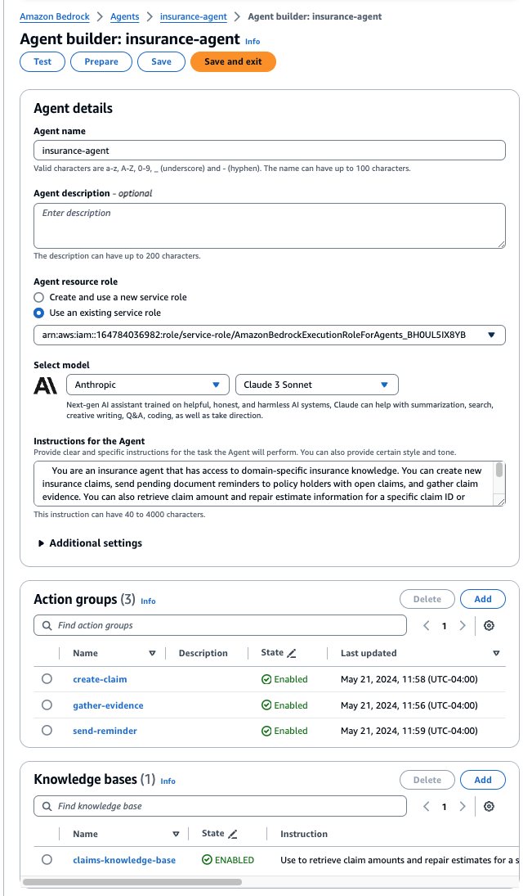

# Deployment Guide
---

## Content
- [Pre-Implementation](#pre-Implementation)
- [Create Knowledge Base](#create-knowledge-base)
- [Create Agent](#create-agent)
- [Testing and Validation](#testing-and-validation)
## Pre-Implementation
### Enable Anthropic Claude3 Sonnet
Navigate to the [Amazon Bedrock > Model access console](https://us-west-2.console.aws.amazon.com/bedrock/home?region=us-west-2#/modelaccess):
- Select **Modify model access**

- On the edit model access page, Select the checkbox for **Claude 3 Sonnet** and **Titan Embeddings G1 - Text**
  
- Select **Next** at the bottom of the page and then **Submit** on the Review and submit page.
  

### Create Cloud9 Environment
Navigate to the [Cloud9 > Create environment console](https://us-west-2.console.aws.amazon.com/cloud9control/home?region=us-west-2#/):
- Under **Details**, enter a name for the Cloud9 environment
  
- Leave all the other options at their default and select **Create** to create the environment
  
- Under the **Environments** section there should be an entry for the Cloud9 environment that was just created. Select **Open** for it. It may take a minute to open if the environment is still creating.
   
   
### Clone [_amazon-bedrock-samples_](https://github.com/csciarri/amazon-bedrock-samples) Repository
Within the Cloud9 IDE that you have just opened, create a local copy of the **amazon-bedrock-samples** repository using _git clone_:

```sh
git clone https://github.com/csciarri/amazon-bedrock-samples.git
```

### Deploy CloudFormation Stack to Emulate Existing Customer Resources 
To emulate the existing customer resources utilized by the agent, this solution uses the [create-customer-resources.sh](../shell/create-customer-resources.sh) shell script to automate provisioning of the parameterized CloudFormation template, [bedrock-customer-resources.yml](../cfn/bedrock-customer-resources.yml).

1. Before you run the shell script, navigate to the directory where you cloned the _amazon-bedrock-samples_ repository and modify the shell script permissions to executable:

```sh
# If not already cloned, clone the remote repository (https://github.com/csciarri/amazon-bedrock-samples) and change working directory to shell folder:
cd amazon-bedrock-samples/agents-for-bedrock/use-case-examples/insurance-claim-lifecycle-automation/shell/
chmod u+x create-customer-resources.sh
```

2. Set your CloudFormation stack name, SNS email, and evidence upload URL environment variables. The SNS email will be used for policy holder notifications and the evidence upload URL will be shared with policy holders to upload their claims evidence. The [insurance claims processing sample](https://github.com/aws-samples/serverless-eda-insurance-claims-processing/tree/main) provides an example frontend for the evidence upload URL:

```sh
export STACK_NAME=<YOUR-STACK-NAME> # Stack name must be lower case for S3 bucket naming convention
export SNS_EMAIL=<YOUR-POLICY-HOLDER-EMAIL> # Email used for SNS notifications
export EVIDENCE_UPLOAD_URL=<YOUR-EVIDENCE-UPLOAD-URL> # URL provided by the agent to the policy holder for evidence upload
export AWS_REGION=<YOUR-STACK-REGION> # Stack deployment region
```

3. Run the _create-customer-resources.sh_ shell script to deploy the emulated customers resources defined in the _bedrock-customer-resources.yml_ CloudFormation template. These are the resources on which the agent and knowledge base will be built:

```sh
source ./create-customer-resources.sh
```

## Create Knowledge Base
Knowledge Bases for Amazon Bedrock leverage Retrieval Augmented Generation (RAG), a technique that harnesses customer data stores to enhance responses generated by foundation models. Knowledge bases allow agents to access existing customer data repositories without extensive administrator overhead. To connect a knowledge base to your data, you specify an S3 bucket as the [data source](https://docs.aws.amazon.com/bedrock/latest/userguide/knowledge-base-ingest.html). By employing knowledge bases, applications gain enriched contextual information, streamlining development through a fully-managed RAG solution. This level of abstraction accelerates time-to-market by minimizing the effort of incorporating your data into agent functionality and it optimizes cost by negating the necessity for continuous model retraining to leverage private data.

<p align="center">
  <br>
  <span style="display: block; text-align: center;"><em>Diagram 2: Knowledge Bases for Amazon Bedrock Architecture Overview</em></span>
</p>

Knowledge base functionality is delineated through two key processes:

**Pre-Processing Data:**

> 1. Documents undergo segmentation ("chunking") into manageable sections.
> 2. Those chunks are then converted into embeddings using an Amazon Bedrock embedding model.
> 3. The embeddings are utilized to create a vector index, enabling semantic similarity comparisons between user queries and data source text.
     
**Runtime Execution:**

> 4. During runtime, users provide their text input as a prompt.
> 5. User input text is transformed into vectors using an Amazon Bedrock embedding model.
> 6. The vector index is queried for chunks related to the user's query, augmenting the user prompt with additional context retrieved from the vector index.
> 7. The augmented prompt, coupled with the additional context, is then used to generate a response for the user.

### Deploy Knowledge Base

1. Navigate to the [Amazon Bedrock > Knowledge base > Create knowledge base console](https://us-west-2.console.aws.amazon.com/bedrock/home?region=us-west-2#/knowledge-bases/create-knowledge-base):

    a. Under **Provide knowledge base details**, enter a name and the following optional description, leaving all other default settings. Then select **Next**.
    ```
    Use to retrieve claim amount and repair estimate information for claim ID, or answer general insurance questions about things like coverage, premium, policy, rate, deductible, accident, and documents
    ```
    b. Under **Configure data source**, enter a name for the data source, then choose _Browse S3_ and select the 'knowledge-base-assets' folder of the data source S3 bucket you deployed in the preceding deployment step (e.g., \<YOUR-STACK-NAME>-customer-resources/agent/knowledge-base-assets/). Then select **Next**

    <p align="center">
      <br>
      <span style="display: block; text-align: center;"><em>Figure 1: Knowledge Base Data Source Configuration</em></span>
    </p>

    c. Under **Select embeddings model and configure vector store**, select _Titan Embeddings G1 - Text_. Under Vector database, leave the 'Quick create a new vectore store' selected and leave the other default settings as is. An [OpenSearch Serverless collection](https://docs.aws.amazon.com/opensearch-service/latest/developerguide/serverless-vector-search.html) will be created for you. This vector store is where the knowledge base pre-processing embeddings are stored and later used for semantic similarity search between queries and data source text. Select **Next**

    d. Under **Review and create**, confirm your configuration settings then select **Create knowledge base**:

<p align="center">
  <br>
  <span style="display: block; text-align: center;"><em>Figure 2: Knowledge Base Configuration Settings</em></span>
</p>

2. Once your knowledge base is created, a green "created successfully" banner will display notifying you to sync your data source. Select **Sync** on the data source to initiate the data source sync:

<p align="center">
  <br>
  <span style="display: block; text-align: center;"><em>Figure 3: Knowledge Base Data Source Sync</em></span>
</p>

3. Navigate to the [Knowledge Bases for Amazon Bedrock console](https://us-west-2.console.aws.amazon.com/bedrock/home?region=us-west-2#/knowledge-bases), select the knowledge base you just created, then note the **Knowledge base ID** under Knowledge base overview:

<p align="center">
  <br>
  <span style="display: block; text-align: center;"><em>Figure 4: Knowledge Base Overview</em></span>
</p>

4. With your knowledge base still selected in the knowledge base console, select your knowledge base data source listed under **Data source**, then note the **Data source ID** under _Data source overview_:

<p align="center">
  <br>
  <span style="display: block; text-align: center;"><em>Figure 5: Knowledge Base Data Source Overview</em></span>
</p>

❗ Knowledge base ID and Data source ID will be used as environment variables in the later _Deploy Streamlit Web UI for Your Agent_ section.

## Create Agent
Agents operate through a build-time execution process, comprising several key components:

- **Foundation Model:** Users select a foundation model that guides the agent in interpreting user inputs, generating responses, and directing subsequent actions during its orchestration process.
- **Instructions:** Users craft detailed instructions that outline the agent's intended functionality. Optional advanced prompts allow customization at each orchestration step, incorporating Lambda functions to parse outputs.
- **(Optional) Action Groups:** Users define actions for the agent, leveraging an OpenAPI schema to define APIs for task execution and Lambda functions to process API inputs and outputs.
- **(Optional) Knowledge Bases:** Users can associate agents with knowledge bases, granting access to additional context for response generation and orchestration steps.

The agent in this sample solution will use an Anthropic Claude 3 Sonnet foundation model, a set of instructions, three action groups, and one knowledge base.

### Deploy Agent

1. Navigate to the [Amazon Bedrock > Agents console](https://us-west-2.console.aws.amazon.com/bedrock/home?region=us-west-2#/agents/):

2. Select **Create Agent**

    a. Enter an agent name and optional description. Select **Create**.

    b. In the Agent details, under **Select model**, select _Anthropic Claude 3 Sonnet_ and specify the following instructions for the agent:
    ```
    You are an insurance agent that has access to domain-specific insurance knowledge. You can create new insurance claims, send pending document reminders to policy holders with open claims, and gather claim evidence. You can also retrieve claim amount and repair estimate information for a specific claim ID or answer general insurance questions about things like coverage, premium, policy, rate, deductible, accident, documents, resolution, and condition. You can answer internal questions about things like which steps an agent should follow and the company's internal processes. You can respond to questions about multiple claim IDs within a single conversation.
    ```

    c. Select **Save** at the top of the page.

    d. In **Action groups**, select **add**. We will create the following three action groups. Each action group should be 

    **Action group 1 - create-claim:**
    > i. **Name** create-claim
    > ii. **Description:** Use this action group to create an insurance claim.
    >
    > iii. Under Action group type, select **Define with API schemas**
    > 
    > iiii. Under Action group invocation select **Select an existing Lambda function**, choose _<YOUR-STACK-NAME>-CreateClaimFunction_.
    > 
    > iiiii. Under Action Group Schema, select **Select an existing API schema**, select the _Browse S3_ button, pick the bucket created during the preceding deployment step (e.g., \<YOUR-STACK-NAME>-customer-resources), then select _agent/api-schema/create_claim.json_.
    > 
    > iiiiiii. Select **Create** and repeat the process for the next 2 action groups.

    <p align="center">
      <br>
      <span style="display: block; text-align: center;"><em>Figure 6: Action Group Configuration</em></span>
    </p>

    **Action group 2 - gather-evidence:**

    > i. **Name** gather-evidence
    > ii. **Description:** Use this action group to create an insurance claim.
    >
    > iii. Under Action group type, select **Define with API schemas**
    > 
    > iiii. Under Action group invocation select **Select an existing Lambda function**, choose _<YOUR-STACK-NAME>-GatherEvidenceFunction_.
    > 
    > iiiii. Under Action Group Schema, select **Select an existing API schema**, select the _Browse S3_ button, pick the bucket created during the preceding deployment step, then select _agent/api-schema/gather_evidence.json_.

    **Action group 3 - send-reminder:**

    > i. **Name** send-reminder
    > ii. **Description:** Use this action group to create an insurance claim.
    >
    > iii. Under Action group type, select **Define with API schemas**
    > 
    > iiii. Under Action group invocation select **Select an existing Lambda function**, choose _<YOUR-STACK-NAME>-SendReminderFunction_.
    > 
    > iiiii. Under Action Group Schema, select **Select an existing API schema**, select the _Browse S3_ button, pick the bucket created during the preceding deployment step, then select _agent/api-schema/send_reminder.json_.
    > 
    e. Select **Save** at the top of the page.
  
3. Add Knowledge Bases to agent:
  a. Under Knowledge bases, Select **Add**
    > i. Under **Select knowledge base**, select the knowledge base you created in the preceding deployment step (e.g., claims-knowledge-base).
    >
    > ii. Under **Knowledge base instructions for Agent**, enter the following then select **Add**:

    ```
   Use to retrieve claim amounts and repair estimates for a specific claim ID, or answer general insurance questions about things like coverage, premium, policy, rate, deductible, accident, and documents
    ```
   
    <p align="center">
      <br>
      <span style="display: block; text-align: center;"><em>Figure 7: Agent Knowledge Base Configuration</em></span>
    </p>

4. On the main Agent builder screen, confirm your agent configuration looks similar to below with the instructions for the agent filled in, 3 Action Groups created and 1 Knowledge Base configured similar to the screen shot below. Select **Save and exit**. Then select **Prepare** on the Test window pane.

<p align="center">
  <br>
  <span style="display: block; text-align: center;"><em>Figure 8: Agent Configuration Settings</em></span>
</p>

Once your agent is created, you will see a green "successfully created" banner.

<p align="center">
  <br>
  <span style="display: block; text-align: center;"><em>Figure 9: Agent Successfully Created Banner</em></span>
</p>

With your agent and knowledge base successfully created, continue to [Testing and Validation](../documentation/testing-and-validation.md).

## Testing and Validation
see [Testing and Validation](../documentation/testing-and-validation.md)

---

## README
see [README](../README.md)

---

Copyright Amazon.com, Inc. or its affiliates. All Rights Reserved.
SPDX-License-Identifier: MIT-0
